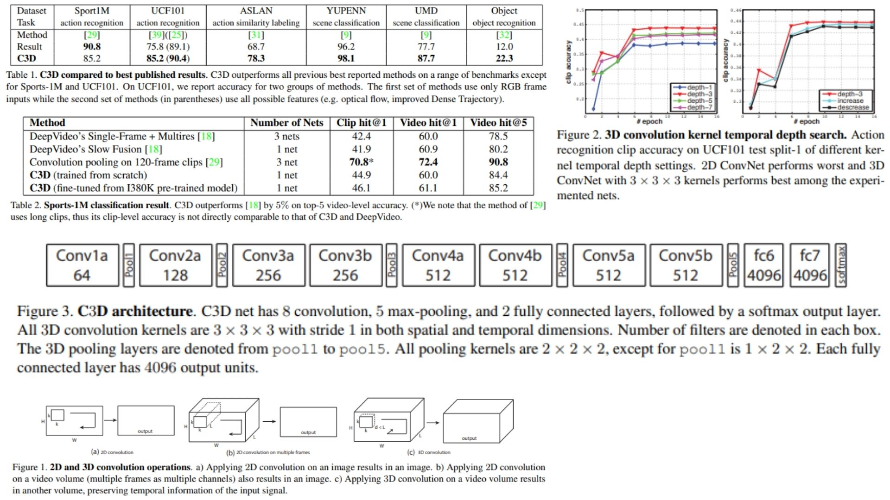

# 🌌 C3D – Learning Spatiotemporal Features with 3D ConvNets

This repository presents a **clean, minimal, and faithful replication** of the **C3D (3D Convolutional Network)** architecture in PyTorch.  
The goal is not training a leaderboard model, but **turning the theory of the original paper into a transparent, inspectable implementation** that clearly exposes how spatiotemporal features are learned from raw video clips.

- Joint modeling of **space and time** via 3D convolutions 🧊  
- Pure RGB input — **no optical flow, no trajectories** 🌒  
- Modular blocks reflecting the original C3D design 🧠  
- Designed for **feature extraction**, analysis, and extension 🫧  

**Paper reference:** [Learning Spatiotemporal Features with 3D Convolutional Networks](https://arxiv.org/abs/1412.0767) 🎢


---

## 🌠 Overview – C3D Architecture



The C3D model processes short video clips as **spatiotemporal volumes** rather than isolated frames:

- Input clips are sequences of RGB frames stacked along the temporal axis.  
- **3D convolutions** operate jointly over time, height, and width, producing feature volumes instead of 2D maps.  
- Early layers focus on **appearance**, while deeper layers increasingly emphasize **salient motion**.  
- Temporal resolution is reduced **gradually** using carefully designed 3D pooling operations.  
- High-level representations are extracted via fully connected layers and can be reused as generic video descriptors.

The figures in the original paper illustrate the contrast between 2D and 3D convolutions, kernel depth exploration, and learned motion-aware features. Here, we mirror those ideas without overengineering the implementation.

---

## 📐 Core Mathematical Idea

Unlike 2D ConvNets, C3D applies convolution in **three dimensions**.

Given an input video clip:
$$X \in \mathbb{R}^{C \times L \times H \times W}$$

a 3D convolution kernel:
$$W \in \mathbb{R}^{C' \times C \times d \times k \times k}$$

produces an output volume:
$$Y = W * X$$

where:
- $$L$$ is the temporal length (number of frames),
- $$d$$ is the **temporal kernel depth**,
- $$k \times k$$ is the spatial receptive field.

This operation **preserves temporal structure**, unlike 2D convolutions that collapse time immediately.

Pooling is also performed spatiotemporally:
$$text{Pool}_{3D}: \mathbb{R}^{C \times L \times H \times W}
\rightarrow
\mathbb{R}^{C \times \frac{L}{s_t} \times \frac{H}{s_h} \times \frac{W}{s_w}}$$

with special care taken in early layers to **avoid destroying temporal information too soon**.

---

## 🧩 What C3D Learns

Visualization via deconvolution (as shown in the paper) reveals an interesting behavior:

- Initial frames activate features related to **objects and appearance**.  
- Subsequent frames increasingly activate features tracking **meaningful motion**.  

In short:  
C3D first understands *what is there*, then focuses on *what moves* ✨

This emerges **without explicit motion supervision**, optical flow, or handcrafted descriptors — purely from 3D convolutional structure.

---

## 📦 Repository Structure

```bash
C3D-Replication/
├── src/
│   ├── layers/
│   │   ├── conv3d_layer.py
│   │   ├── pool3d_layer.py
│   │   ├── relu_layer.py
│   │   ├── flatten_layer.py
│   │   ├── fc_layer.py
│   │   └── utils_layers.py
│   │
│   ├── blocks/
│   │   ├── c3d_block.py          # Conv + ReLU + Pool chains
│   │   └── feature_head.py       # Pool + Flatten + FC
│   │
│   ├── model/
│   │   └── c3d_network.py
│   │
│   └── config.py
│
├── images/
│   ├── figmix.jpg
│   └── figmix2.jpg
│
├── requirements.txt
└── README.md
```
---


## 🔗 Feedback

For questions or feedback, contact: [barkin.adiguzel@gmail.com](mailto:barkin.adiguzel@gmail.com)
